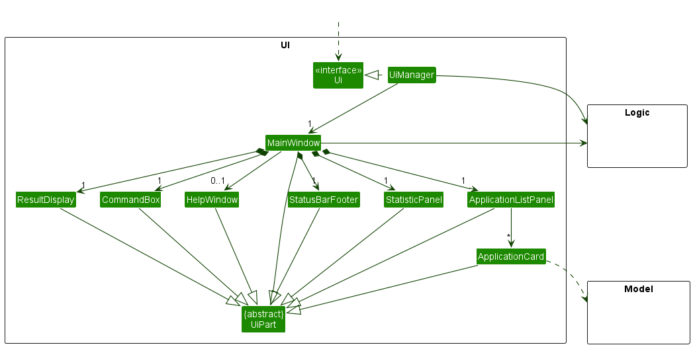
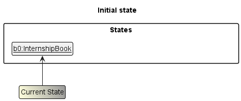
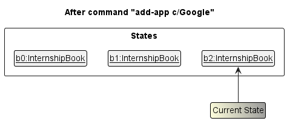
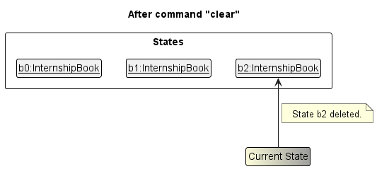

* Table of Contents
{:toc}

--------------------------------------------------------------------------------------------------------------------

## **1. Introduction**

### 1.1 About sprINT 

**sprINT** is an **internship-tracking application** that was created to assist students in their internship hunt. 

Students often face a great administrative burden in keeping track of the high volume of job or internship 
applications. With sprINT, students can easily manage details of their internship applications, including the company, 
contacts, status and task deadlines.

### 1.2 About this guide

This developer guide details the high-level software architecture and design decisions for the implementation of sprINT.
It is intended for:

* Advanced users who wish to get a better understanding of sprINT's features
* Present and future developers, designers and testers of sprINT 

--------------------------------------------------------------------------------------------------------------------

## **2. Acknowledgements**

sprINT is adapted from the [AddressBook-Level3](https://se-education.org/addressbook-level3/) 
project created by the SE-EDU initative. 

--------------------------------------------------------------------------------------------------------------------

## **3. Setting up, getting started**

Refer to the guide [_Setting up and getting started_](SettingUp.md).

--------------------------------------------------------------------------------------------------------------------

## **4. Design**
### Architecture

The ***Architecture Diagram*** given above explains the high-level design of the App.

Given below is a quick overview of main components and how they interact with each other.

**Main components of the architecture**

**`Main`** has two classes called [`Main`](https://github.com/se-edu/addressbook-level3/tree/master/src/main/java/seedu/address/Main.java) and [`MainApp`](https://github.com/se-edu/addressbook-level3/tree/master/src/main/java/seedu/address/MainApp.java). It is responsible for,
* At app launch: Initializes the components in the correct sequence, and connects them up with each other.
* At shut down: Shuts down the components and invokes cleanup methods where necessary.

[**`Commons`**](#common-classes) represents a collection of classes used by multiple other components.

The rest of the App consists of four components.

* [**`UI`**](#ui-component): The UI of the App.
* [**`Logic`**](#logic-component): The command executor.
* [**`Model`**](#model-component): Holds the data of the App in memory.
* [**`Storage`**](#storage-component): Reads data from, and writes data to, the hard disk.

**How the architecture components interact with each other**

The *Sequence Diagram* below shows how the components interact with each other for the scenario where the user issues the command `delete-app 1`.

Each of the four main components (also shown in the diagram above),

* defines its *API* in an `interface` with the same name as the Component.
* implements its functionality using a concrete `{Component Name}Manager` class (which follows the corresponding API `interface` mentioned in the previous point.

For example, the `Logic` component defines its API in the `Logic.java` interface and implements its functionality using the `LogicManager.java` class which follows the `Logic` interface. Other components interact with a given component through its interface rather than the concrete class (reason: to prevent outside component's being coupled to the implementation of a component), as illustrated in the (partial) class diagram below.

The sections below give more details of each component.

### UI component

The **API** of this component is specified in [`Ui.java`](https://github.com/AY2223S2-CS2103T-T13-3/tp/master/src/main/java/seedu/address/ui/Ui.java)

The UI consists of a `MainWindow` that is made up of parts e.g.`CommandBox`, `ResultDisplay`, `ApplicationListPanel`, `StatusBarFooter` etc. All these, including the `MainWindow`, inherit from the abstract `UiPart` class which captures the commonalities between classes that represent parts of the visible GUI.

The `UI` component uses the JavaFx UI framework. The layout of these UI parts are defined in matching `.fxml` files that are in the `src/main/resources/view` folder. For example, the layout of the [`MainWindow`](https://github.com/AY2223S2-CS2103T-T13-3/tp/tree/master/src/main/java/seedu/address/ui/MainWindow.java) is specified in [`MainWindow.fxml`](https://github.com/AY2223S2-CS2103T-T13-3/tp/tree/master/src/main/resources/view/MainWindow.fxml)

The `UI` component,

* executes user commands using the `Logic` component.
* listens for changes to `Model` data so that the UI can be updated with the modified data.
* keeps a reference to the `Logic` component, because the `UI` relies on the `Logic` to execute commands.
* depends on some classes in the `Model` component, as it displays `Person` object residing in the `Model`.

### Logic component

**API** : [`Logic.java`](https://github.com/AY2223S2-CS2103T-T13-3/tp/master/src/main/java/seedu/address/logic/Logic.java)

Here's a (partial) class diagram of the `Logic` component:

How the `Logic` component works:
1. When `Logic` is called upon to execute a command, it uses the `InternshipBookParser` class to parse the user command.
1. This results in a `Command` object (more precisely, an object of one of its subclasses e.g., `AddApplicationCommand`) which is executed by the `LogicManager`.
1. The command can communicate with the `Model` when it is executed (e.g. to add a person).
1. The result of the command execution is encapsulated as a `CommandResult` object which is returned back from `Logic`.

The Sequence Diagram below illustrates the interactions within the `Logic` component for the `execute("delete-app 1")` API call.

:information_source: **Note:** The lifeline for `DeleteCommandParser` 
should end at the destroy marker (X) but due to a limitation of PlantUML, the lifeline reaches the end of diagram.

Here are the other classes in `Logic` (omitted from the class diagram above) that are used for parsing a user command:

How the parsing works:
* When called upon to parse a user command, the `InternshipBookParser` class creates an `XYZCommandParser` (`XYZ` is a placeholder for the specific command name e.g., `AddApplicationCommandParser`) which uses the other classes shown above to parse the user command and create a `XYZCommand` object (e.g., `AddApplicationCommand`) which the `InternshipBookParser` returns back as a `Command` object.
* All `XYZCommandParser` classes (e.g., `AddApplicationCommandParser`, `DeleteApplicationCommandParser`, ...) inherit from the `Parser` interface so that they can be treated similarly where possible e.g, during testing.

### Model component
**API** : [`Model.java`](https://github.com/AY2223S2-CS2103T-T13-3/tp/tree/master/src/main/java/seedu/address/model/Model.java)

The `Model` component,

* stores the address book data i.e., all `Application` objects (which are contained in a `UniqueApplicationList` object).
* stores the currently 'selected' `Application` objects (e.g., results of a search query) as a separate _filtered_ list which is exposed to outsiders as an unmodifiable `ObservableList<Application>` that can be 'observed' e.g. the UI can be bound to this list so that the UI automatically updates when the data in the list change.
* stores a `UserPref` object that represents the user’s preferences. This is exposed to the outside as a `ReadOnlyUserPref` objects.
* does not depend on any of the other three components (as the `Model` represents data entities of the domain, they should make sense on their own without depending on other components)

### Storage component

**API** : [`Storage.java`](https://github.com/AY2223S2-CS2103T-T13-3/tp/tree/master/src/main/java/seedu/address/storage/Storage.java)

The `Storage` component,
* can save both internship book data and user preference data in json format, and read them back into corresponding objects.
* inherits from both `InternshipBookStorage` and `UserPrefStorage`, which means it can be treated as either one (if only the functionality of only one is needed).
* depends on some classes in the `Model` component (because the `Storage` component's job is to save/retrieve objects that belong to the `Model`)

### Common classes

Classes used by multiple components are in the `seedu.addressbook.commons` package.

--------------------------------------------------------------------------------------------------------------------

## **Implementation**

This section describes some noteworthy details on how certain features are implemented.

### \[In Progress\] Sort feature

#### About
sprINT offers the options to sort the applications list in two ways:
- `sort deadline` will sort by the deadline of upcoming tasks
- `sort alphabetical` will sort by the alphabetical order of the internship roles; if there are two internship roles 
that are the same, the tiebreaker will be the alphabetical order of the company name

#### Implementation
_to be added_

### \[Proposed\] Undo/redo feature

#### Proposed Implementation

The proposed undo/redo mechanism is facilitated by `VersionedAddressBook`. It extends `AddressBook` with an undo/redo history, stored internally as an `addressBookStateList` and `currentStatePointer`. Additionally, it implements the following operations:

* `VersionedAddressBook#commit()` — Saves the current address book state in its history.
* `VersionedAddressBook#undo()` — Restores the previous address book state from its history.
* `VersionedAddressBook#redo()` — Restores a previously undone address book state from its history.

These operations are exposed in the `Model` interface as `Model#commitAddressBook()`, `Model#undoAddressBook()` and `Model#redoAddressBook()` respectively.

Given below is an example usage scenario and how the undo/redo mechanism behaves at each step.

Step 1. The user launches the application for the first time. The `VersionedAddressBook` will be initialized with the initial address book state, and the `currentStatePointer` pointing to that single address book state.

Step 2. The user executes `delete 5` command to delete the 5th person in the address book. The `delete` command calls `Model#commitAddressBook()`, causing the modified state of the address book after the `delete 5` command executes to be saved in the `addressBookStateList`, and the `currentStatePointer` is shifted to the newly inserted address book state.

Step 3. The user executes `add n/David …​` to add a new person. The `add` command also calls `Model#commitAddressBook()`, causing another modified address book state to be saved into the `addressBookStateList`.

:information_source: **Note:** If a command fails its execution, it will not call `Model#commitAddressBook()`, so the address book state will not be saved into the `addressBookStateList`.

Step 4. The user now decides that adding the person was a mistake, and decides to undo that action by executing the `undo` command. The `undo` command will call `Model#undoAddressBook()`, which will shift the `currentStatePointer` once to the left, pointing it to the previous address book state, and restores the address book to that state.

:information_source: **Note:** If the `currentStatePointer` is at index 0, pointing to the initial AddressBook state, then there are no previous AddressBook states to restore. The `undo` command uses `Model#canUndoAddressBook()` to check if this is the case. If so, it will return an error to the user rather
than attempting to perform the undo.

The following sequence diagram shows how the undo operation works:

:information_source: **Note:** The lifeline for `UndoCommand` should end at the destroy marker (X) but due to a limitation of PlantUML, the lifeline reaches the end of diagram.

The `redo` command does the opposite — it calls `Model#redoAddressBook()`, which shifts the `currentStatePointer` once to the right, pointing to the previously undone state, and restores the address book to that state.

:information_source: **Note:** If the `currentStatePointer` is at index `addressBookStateList.size() - 1`, pointing to the latest address book state, then there are no undone AddressBook states to restore. The `redo` command uses `Model#canRedoAddressBook()` to check if this is the case. If so, it will return an error to the user rather than attempting to perform the redo.

Step 5. The user then decides to execute the command `list`. Commands that do not modify the address book, such as `list`, will usually not call `Model#commitAddressBook()`, `Model#undoAddressBook()` or `Model#redoAddressBook()`. Thus, the `addressBookStateList` remains unchanged.

Step 6. The user executes `clear`, which calls `Model#commitAddressBook()`. Since the `currentStatePointer` is not pointing at the end of the `addressBookStateList`, all address book states after the `currentStatePointer` will be purged. Reason: It no longer makes sense to redo the `add n/David …​` command. This is the behavior that most modern desktop applications follow.

The following activity diagram summarizes what happens when a user executes a new command:

#### Design considerations:

**Aspect: How undo & redo executes:**

* **Alternative 1 (current choice):** Saves the entire address book.
  * Pros: Easy to implement.
  * Cons: May have performance issues in terms of memory usage.

* **Alternative 2:** Individual command knows how to undo/redo by
  itself.
  * Pros: Will use less memory (e.g. for `delete`, just save the person being deleted).
  * Cons: We must ensure that the implementation of each individual command are correct.

_{more aspects and alternatives to be added}_

### \[Proposed\] Data archiving

_{Explain here how the data archiving feature will be implemented}_

### Add Task feature

#### Description

The `add-task` command allows users to add a task to an existing application in the internship book, specified by
its index, with the parameters `description` and `deadline`. 

#### Implementation

The following sequence diagram illustrates how sprINT's internal components interact with one another in response 
to the `add-task` command.

When a user enters the `add-task` command: 
1. The `parse` method of `AddTaskCommandParser` is invoked.
   1. The target application's `index`, along with the `deadline` and `description` fields for the new task,
      are extracted from the command string. 
   2. A new `EditApplicationDescriptor` object, which stores details about the new task for the target application,
      is created. 
   3. A new `AddTaskCommand` object containing the target application's `index` and the aforementioned `descriptor` 
      is created.
2. The newly created `AddTaskCommand` object is then executed. 
   1. The `createEditedApplication` method of the `EditApplicationCommand` class is invoked to create a new 
       application with the task added. This represents the edited application.
   2. This `editedApplication` object replaces the existing `Application` object in the model. 

#### Design Considerations

**Aspect: How `add task` executes**
  
* **Option 1** (Current design): use existing logic from the `EditApplicationCommand` class (i.e. 
  `createEditedApplication` and `EditApplicationDescriptor`)
  * Pros:
    * Reduces duplicate code (and thus code redundancy).
    * Makes sense from a logical perspective: since `Task` is implemented as just another field in `Application`, 
      _adding a task_ to an application is essentially just another interface for _editing_ the application.
  * Cons:
    * Increases coupling between `AddTaskCommand` and `EditApplicationCommand`.

* **Option 2**: implement logic for `createEditedApplication` and `EditApplicationDescriptor` **within** the 
    `AddTaskCommand` class
    * Pros:
      * Reduces coupling between `AddTaskCommand` and `EditApplicationCommand`.
    * Cons:
      * Increases code redundancy.
      * Violates Single Responsibility Principle.

--------------------------------------------------------------------------------------------------------------------

## **Documentation, logging, testing, configuration, dev-ops**

* [Documentation guide](Documentation.md)
* [Testing guide](Testing.md)
* [Logging guide](Logging.md)
* [Configuration guide](Configuration.md)
* [DevOps guide](DevOps.md)

--------------------------------------------------------------------------------------------------------------------

## **Appendix: Requirements**

### Product scope

**Target user profile**:

* is a student going to or is currently applying for internships
* has a need to manage a significant number of internship applications
* prefer desktop apps over other types of apps
* can type fast
* prefers typing to mouse interactions
* is reasonably comfortable using CLI apps

**Value proposition**: manages internship applications faster than a typical mouse/GUI driven app

### User stories

Priorities: High (must have) - `* * *`, Medium (nice to have) - `* *`, Low (unlikely to have) - `*`

| Priority | As a …​               | I want to …​                                     | So that I can…​                                                                              |
|----------|-----------------------|--------------------------------------------------|----------------------------------------------------------------------------------------------|
| `* * *`  | new or forgetful user | see usage instructions                           | refer to instructions when I first start using sprINT or when I forget how to use it         |
| `* * *`  | user                  | view all application entries                     | look through all of them easily                                                              |
| `* * *`  | user                  | add a new application entry                      |                                                                                              |
| `* * *`  | user                  | edit an new application entry                    | update progress of an internship application or amend mistakes I might have made in an entry |
| `* * *`  | neat user             | delete an application entry                      | remove entries that I no longer need                                                         |
| `* * *` | user                  | add an upcoming task to an application           | remind myself of the work I need to do for this application                                  |
| `* * *` | user                  | edit an upcoming task for an application         | update the application with the next task I need to complete                                 |
| `* *`    | user                  | find application entry to a specified company    | keep track of all the positions I have applied to at this company more easily                |
| `* *`    | user                  | find application entry with a specified role     | keep track of all the applications with this role                                            |
| `* *`    | user                  | find application entry with a specified deadline | keep track of all the applications and their upcoming tasks I need to complete by then       |
| `* *`    | user                  | sort application entries by specified order      | view them in order to get a better idea which ones to prioritise                             |
| `* *`    | clumsy user           | undo a command                                   | if I ever typed one by mistake                                                               |
| `* `     | user                  | tag an application                               | label them as I wish                                                                         |
| `* `     | data-oriented user    | view statistics of all my application entries    | get the general idea of how well I'm doing in my internship hunt                             |
*{More to be added}*

### Use cases

(For all use cases below, the **System** refers to `sprINT` and the **Actor** refers to the `user`, unless specified otherwise)

**Use case 1: Add an application entry**

**MSS**

1. User provides application details (role applied, company name, company email and status).
2. sprINT creates the application entry and shows the updated list of application entries.

    Use case ends.

**Extensions**

* 1a. User did not provide details for mandatory fields.
  * 1a1. sprINT displays an error message that shows fields that are missing.
  * 1a2. sprINT prompts User to try again.
  
    Use case resumes at step 1.
        
* 1b. Error occurred when parsing arguments for certain fields.
  * 1b1. sprINT displays an error message that shows the first incorrect field value entered.
  * 1b2. sprINT prompts User to try again.
    
    Use case resumes at step 1.
        
* 1c. Application already exists in the database.
  * 1c1. sprINT displays an error message that informs User of a duplicate application entry.
  * 1c2. sprINT prompts User to try again.
        
    Use case resumes at step 1.

---

**Use case 2: Edit an application entry**

**MSS**

1. User requests to list all application entries.
2. sprINT displays a list of all application entries.
3. User requests to edit a specific application entry in the list.
4. sprINT updates the application entry and shows updated list of entries.

   Use case ends.

**Extensions**

* 2a. The list is empty.

  Use case ends.

* 3a. The given index is invalid (e.g. not an integer or out of bound).
  * 3a1. sprINT shows an error message.
  
    Use case resumes at step 2.
  
* 3b. No index is given.
  * 3b1. sprINT displays an error message.
  
    Use case resumes at step 2.

---

**Use case 3: Delete an application entry**

**MSS**

1. User requests to list all application entries.
2. sprINT displays a list of all application entries.
3. User requests to delete a specific application entry in the list.
4. sprINT updates the application entry and displays updated list of entries.

   Use case ends.

**Extensions**

* 2a. The list is empty.

  Use case ends.

* 3a. The given index is invalid (e.g. not an integer or out of bound).
    * 3a1. sprINT shows an error message.

      Use case resumes at step 2.

* 3b. No index is given.
    * 3b1. sprINT displays an error message.

      Use case resumes at step 2.

___

**Use case 4: Find applications for a specified company**

**MSS**

1. User requests to find applications using the company name as the keyword.
2. sprINT displays the filtered list of entries.

   Use case ends.

**Extensions**

* 1a. No keyword is given.
  * sprINT displays an error message.

    Use case resumes at step 1.

* 2a. No matching applications are found and the filtered list is empty.
  
  Use case resumes at step 2.

---

**Use case 5: Sort applications by specified order**

**MSS**

1. User requests to sort applications by alphabetical order.
2. sprINT displays the sorted list of entries.

    Use case ends.

**Extensions**

* 1a. User requests to sort applications by order of deadline of their upcoming task, with applications that have
upcoming tasks of closer deadlines being showed first.
* sprINT displays the sorted list of entries.

    Use case ends.

*{More to be added}*

### Non-Functional Requirements

1. Should work on any _mainstream OS_ as long as it has Java `11` or above installed.
2. Should take less than 500MB of memory while in operation.
3. Should be able to view all (up to 1500) application entries on the homepage interface without noticeable lags.
4. Will not perform any automated tasks e.g., send periodic reminders. Hence, sprINT will not have a server component.
5. A user with above average typing speed for regular English text (i.e. not code, not system admin commands) should be able to accomplish most of the tasks faster using commands than using the mouse.

*{More to be added}*

### Glossary

#### sprINT-specific Terminology

* **Application**: Represents an internship application entry in the internship book. Each application contains a role,
company name, company email and one of four possible statuses.

* **Status**: Represents the current stage of the internship application. Can be one of 4 values:
  * **Interested**: An internship that the user is interested in, but has yet to apply to. 
  * **Applied**: An internship that the user has applied to, but has yet to receive an offer or rejection for.  
  * **Offered**: An internship that the user has received an offer for. 
  * **Rejected**: An internship that the user has been rejected for. 

* **Task**: Represents additional requirements or milestones that are part of the internship application process.
Examples include online assessment, technical interview, etc.

#### Others

* **GUI**: Graphical User Interface
* **CLI**: Command Line Interface
* **Mainstream OS**: Windows, Linux, Unix, OS-X

--------------------------------------------------------------------------------------------------------------------

## **Appendix: Instructions for manual testing**

Given below are instructions to test the app manually.

:information_source: **Note:** These instructions only provide a starting point for testers to work on;
testers are expected to do more *exploratory* testing.

### Launch and shutdown

1. Initial launch

   1. Download the jar file and copy into an empty folder

   1. Double-click the jar file Expected: Shows the GUI with a set of sample contacts. The window size may not be optimum.

1. Saving window preferences

   1. Resize the window to an optimum size. Move the window to a different location. Close the window.

   1. Re-launch the app by double-clicking the jar file. 
       Expected: The most recent window size and location is retained.

1. _{ more test cases …​ }_

### Deleting a person

1. Deleting a person while all persons are being shown

   1. Prerequisites: List all persons using the `list` command. Multiple persons in the list.

   1. Test case: `delete 1` 
      Expected: First contact is deleted from the list. Details of the deleted contact shown in the status message. Timestamp in the status bar is updated.

   1. Test case: `delete 0` 
      Expected: No person is deleted. Error details shown in the status message. Status bar remains the same.

   1. Other incorrect delete commands to try: `delete`, `delete x`, `...` (where x is larger than the list size) 
      Expected: Similar to previous.

1. _{ more test cases …​ }_

### Saving data

1. Dealing with missing/corrupted data files

   1. _{explain how to simulate a missing/corrupted file, and the expected behavior}_

1. _{ more test cases …​ }_
