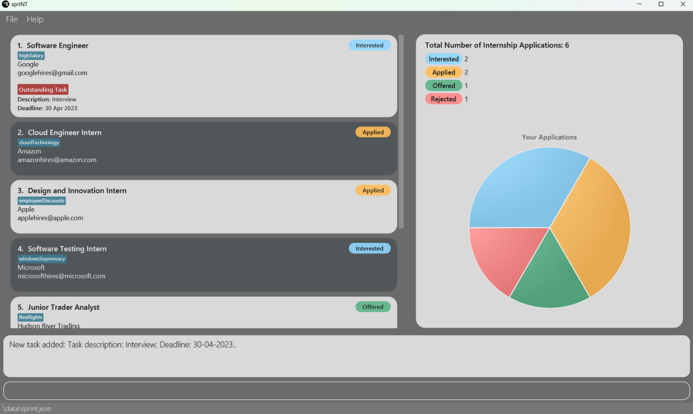
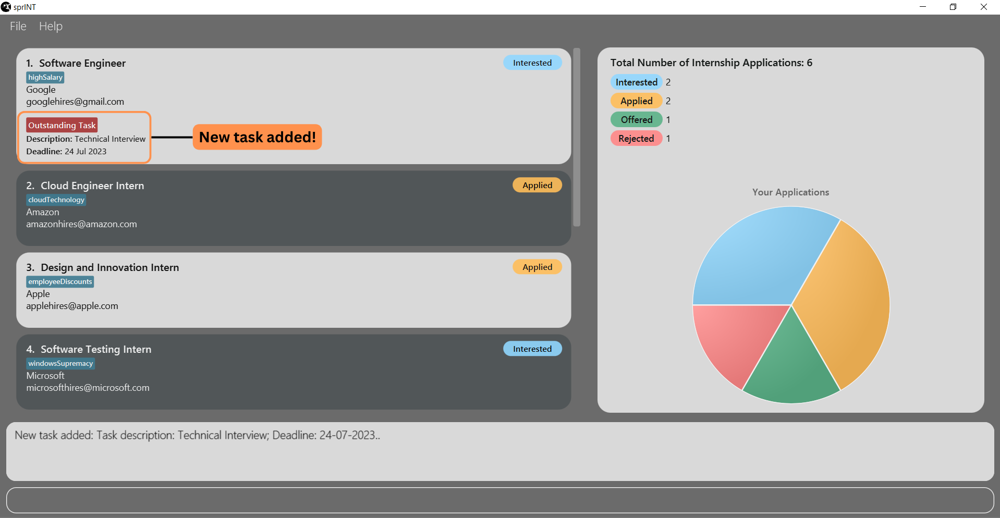
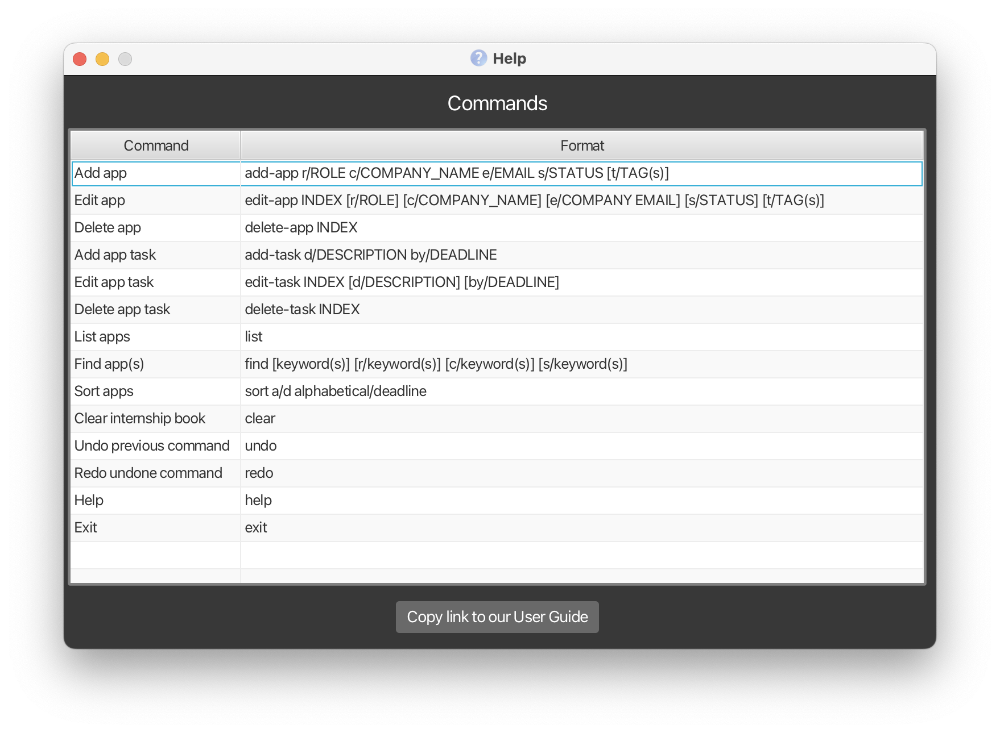

* Table of Contents 
{:toc}

--------------------------------------------------------------------------------------------------------------------

## **1. Introduction**

### 1.1 What is sprINT
Are you a student who wants to avoid the hassle of managing internship applications? Look no further than sprINT, 
the ideal tool for streamlining this daunting process!

sprINT is a **desktop application** that can help YOU track your internship applications.
Optimized for use by typing while offering a beautiful user interface, it will be a great asset in your internship application journey.

### 1.2 Purpose of this document
This document serves as a User Guide for anyone who wants to use sprINT! If you are a new user, 
read through the section on **[Quick start](#2-quick-start)** to learn how to set up the app quickly and the
section on **[Basics](#3-basics)** to pick up a few simple commands. If you have already used sprINT before, use the table
of contents to skip to the specific feature or command in **[Features](#4-features)** you want to know more about!

--------------------------------------------------------------------------------------------------------------------

## **2. Quick start**

Step 1: Ensure you have Java `11` or above installed in your computer.

Step 2: Download the latest jar file`sprINT.jar` from [here](https://github.com/AY2223S2-CS2103T-T13-3/tp/releases/tag/v1.3).

Step 3: Copy the file to the folder you want to use as the _home folder_ for your sprINT application.

Step 4: Double-click on the jar file to run the application.
If it doesn't work, open a command terminal, enter `cd` with the path to the folder you put the jar file in, 
and type: `java -jar sprINT.jar` to run the application. 

An interface similar to the one shown below should appear in a few seconds. Note how the app contains some sample data already. 

:bulb:
**Tip:** The app should work for any laptop or computer regardless of their operating system (e.g., Windows, Linux, etc.)!

## **3. Basics**

1. Notice the **Command Box** at the bottom. This will be where you will type all your commands. Press Enter to execute them.
2. The **Command Result Box** is right above the Command Box. It gives you feedback immediately after you press Enter to execute
a command, informing you if you have executed it successfully, and if not, what to watch out for in the formatting.
Suppose you have executed a command to add a new application entry with the role `ML Engineer Intern` at `Datature`.
Then you will be able to see the box informing you that it has been successfully added, just like in the image above.
3. Each application entry shows up in the list above in its own box. In the image above, you can see the **Application Details**
of the application entry to `Datature` that you have just added.
4. A pie chart at the right shows your **Application Statistics**. It will update immediately after every command you execute,
so there's no need to worry about updating it manually. Pretty neat, right?
5. Here are some simple commands to get you started with:

* `list` : Lists all applications.
* `add-app r/SWE Intern c/Google e/google_careers@gmail.com s/interested` : Adds an
  application for Software Engineer Intern position @ Google that I'm interested in. Deadline of application is 1st of
  January.
* `delete-app 3` : Deletes the 3rd application shown in the current list.
* `clear` : Deletes all application entries. Do this if you want to get rid of the current sample data.
* `exit` : Exits the app.

You can refer to the **[Command summary](#7-command-summary)** section for the complete list of commands.

You can refer to the **[Features](#4-features)** section below for more details of each command.

--------------------------------------------------------------------------------------------------------------------

## **4. Features**

Before you begin reading, here are some useful notations that would help you tremendously:

**Tips**

Tips are useful suggestions that will help you become a seasoned sprINT user more quickly.

:bulb:
**Tip:** Tips are useful information. They can give you a better experience with sprINT.

**Notes**

Notes are important information that you should pay attention to when using sprINT.

:information_source:
**Note:** Take notes when you see this icon.

**Caution**

Cautions are in place to warn you of potential pitfalls new users may encounter.

:exclamation:
**Caution:** Stop and read carefully when you see this!

**:information_source: Notes about the command format:** 

* Words in `UPPER_CASE` are the parameters you need to supply. 
  e.g. in `add c/COMPANY_NAME`, `COMPANY_NAME` is a parameter which can be used as `add c/John Doe's Company`.

* Items in square brackets are optional. 
  e.g. `c/COMPANY_NAME [t/TAG]` can be used as `c/John Doe's Company t/highsalary` or as `c/John Doe's Company` only.

* Items that come with `(s)` means multiple parameters for the same prefix can be added, as long as they are separated by a space. 
  e.g. `[t/TAG(s)]` can be used as `t/creditBearing t/highSalary` or as `t/creditBearing` only.

* Items encapsulated within square brackets (`[]`) are optional. 
  e.g. `[t/TAG]​` means that you can choose to type ` ` (i.e., nothing, no tags at all), 
  or `t/highSalary` for example (i.e., 1 tag).

:exclamation:
**Caution:** Be aware of the difference between `(s)` and `[]`. The former allows for multiple arguments, the latter represents
an optional argument.

* Command words and prefixes are case-sensitive. 
  e.g. `UNDO` will not be recognised as a valid command for the undo operation. Similarly, `bY/` (instead of `by/`) 
  will not be recognised as a valid prefix for the `add-task` command. 

* Parameters can be in any order. 
  e.g. if the command specifies `r/ROLE c/COMPANY_NAME`, `c/COMPANY_NAME r/ROLE` is also acceptable.

* If a parameter is expected only once in the command, but you specified it multiple times, only the last occurrence of the parameter will be taken. 
  e.g. if you specify `r/SWE Intern r/Software Intern`, only `r/Software Intern` will be taken.

* Extraneous parameters for commands that do not take in parameters (such as `help`, `list`, `exit` and `clear`) will be ignored. 
  e.g. if the command specifies `help 123`, it will be interpreted as `help`.

--------------------------------------------------------------------------------------------------------------------

### 4.1 Managing applications

#### 4.1.1 Adding an application : `add-app`

Adds an internship application to be tracked.

Format: `add-app r/ROLE c/COMPANY_NAME e/COMPANY_EMAIL s/STATUS [t/TAG(s)]​`

You can refer to our **[Glossary](#6-glossary)** for more information about each field (ROLE, COMPANY_NAME, etc.) and
other sprINT-specific terminology.

:bulb: **Tip:**
Tag is an optional field when adding an application.
An application can have multiple tags or none at all.

Examples:
* `add-app r/SWE Intern c/Google e/google_careers@gmail.com s/interested t/creditBearing`
* `add-app r/Data Analyst Intern c/Bloomberg e/bloomberg_hires@bloomberg.com`

#### 4.1.2 Editing an application : `edit-app`

Edits an existing internship application to be tracked.

Format: `edit-app INDEX [r/ROLE] [c/COMPANY_NAME] [e/COMPANY_EMAIL] [s/STATUS] [t/TAG(s)]​`

* Edits the internship application at the specified `INDEX`. The index here refers to the index number shown in the displayed application list. The index **must be a positive number**: 1, 2, 3, …​
* At least one of the optional fields must be provided.
* Existing values of the application entry will be updated to what you have inputted.
* When editing tags, the existing corresponding tags for that application will be removed. i.e. the adding of tags is not cumulative.

:information_source:
**Note:** This means that if an application has an existing `highSalary` tag. Executing command `edit-app 1 t/creditBearing` would remove the original
`highSalary` tag, replacing it with the `creditBearing` tag.

* You can remove all of an application’s tags by typing `t/` without specifying any values after it.

Examples:
*  `edit-app 1 r/Cloud Engineer e/googleHR@example.com` Edits the role and email address of the 1st application to be `Cloud Engineer` and `googleHR@gmail.com` respectively.
*  `edit-app 2 s/Rejected t/` Edits the status of the 2nd application to be `Rejected` and clears all existing tags.

#### 4.1.3 Deleting an application : `delete-app`

Deletes the specified application from the internship book.

Format: `delete-app INDEX`

* Deletes the application at the specified `INDEX`.
* The index here refers to the index number of the application shown in the displayed application list.
* The index **must be a positive number**: 1, 2, 3, …​

Examples:
* `list` followed by `delete-app 2` deletes the 2nd application in the internship book.
* `find Google` followed by `delete-app 1` deletes the 1st application shown in the results of the `find` command.

--------------------------------------------------------------------------------------------------------------------

### 4.2 Managing application tasks

#### 4.2.1 Adding an application task : `add-task`

Adds an upcoming task to an existing application.

Format: `add-task INDEX d/DESCRIPTION by/DEADLINE`

* Adds a task to the application at the specified `INDEX`.
* The index here refers to the index number of the application shown in the displayed application list.
* The index **must be a positive number**: 1, 2, 3, …​
* The deadline must be in **DD-MM-YYYY** format.

Example:
I have recently applied to `Google` for their `Software Engineer` role, and made an entry for it in the internship book.
Then, `Google` reaches out to me for a technical interview on the 24th July 2023. I can add this
as a task to the application entry I have created before (suppose it is showing up as the first one in the list) by typing:
`add-task 1 d/Technical Interview by/24-07-2023`

You can see how the new task will then appear for the 1st application entry in the list:

#### 4.2.2 Editing an application task : `edit-task`

Edits an upcoming task for an application entry.

Format: `edit-task INDEX [d/DESCRIPTION] [by/DEADLINE]`

* Edits the internship application at the specified `INDEX`. 
* The index here refers to the index number shown in the displayed
  application list. 
* The index **must be a positive number**: 1, 2, 3, …​
* Existing description and/or deadline of the task will be updated to what you have inputted.

Example:
`edit-task 1 d/Accept offer by/09-07-2023` Edits the description and deadline of the task for the 1st application to be
`Accept offer` and `09-07-2023` respectively.

#### 4.2.3 Deleting an application task : `delete-task`

Deletes the task of the specified application.

Format: `delete-task INDEX`

* Deletes the task of the application at the specified `INDEX`.
* The index here refers to the index number shown in the displayed application list.
* The index **must be a positive number**: 1, 2, 3, …​

:bulb: **Tip:**
Deleting an application's task will not delete the underlying application entry itself.
Refer to the command delete-app if you wish to delete an application entry entirely and all its information (including its task).

Examples:
* `list` followed by `delete-task 2` deletes the task for the 2nd application.
* `find Google` followed by `delete-task 1` deletes the task of the 1st application to be shown in the results of the `find` command.

--------------------------------------------------------------------------------------------------------------------

### 4.3 Managing display for applications

#### 4.3.1 Listing all applications : `list`

Shows a list of all internship applications, in the order of when they are added. Application
entries that are added more recently will be shown on top.

Format: `list`

#### 4.3.2 Finding applications : `find`

Finds internship applications with information containing any of the given keywords.

Format: `find keywords(s)` or `find [r/keyword(s)] [c/keyword(s)] [s/keyword(s)]`

* The keywords are case-insensitive. e.g. You can type `GOoGlE` and it will match with `Google`.
* In `find keyword(s)`, when none of the prefixes is specified, the keyword(s) will be searched globally in the information for all prefixes.
* In `find [r/keyword(s)] [c/keyword(s)] [s/keyword(s)]`, `r/`, `c/` and `s/` are prefixes that stand for `ROLE`, `COMPANY NAME` and `STATUS` respectively.
* When at least one prefix is provided, the keyword(s) is searched according to the information under that particular prefix.
* Only full words will be matched e.g. `Han` will not match `Hans` but `Google` will match with `Google LLC`.

Examples:
* `find Google` returns internship applications for `Google` and `Google LLC`.
* `find Google Meta` returns internship applications for `Google LLC`, `Meta Platforms`. 
* `find r/SWE Intern c/Meta s/Offered` returns internship application(s) for the role of `SWE Intern` at `Meta` that is of the status `Offered`. 

#### 4.3.3 Sorting applications : `sort`

Sorts internship applications in the order you want.

Format: `sort SEQUENCE ORDER`

* Type either `a` or `d` for `SEQEUENCE`. They refer to **ascending** and **descending** respectively. 
Currently, there are two orders you can choose:
* Type either `alphabetical` or `deadline` for `ORDER`.
1. Choosing `alphabetical` will sort applications by their roles in alphabetical order. Should
   there be multiple application entries with the same role, they will be ranked alphabetically by their company names.
2. Choosing `deadline` will display applications with tasks (and therefore, deadlines) only. The applications will be sorted by their task's deadline. 

Examples:
* `sort a deadline` will show applications with task deadlines. Those with earlier deadlines will be higher up in the list.
* `sort d alphabetical` will show applications in descending alphabetical order. (Z to A)

--------------------------------------------------------------------------------------------------------------------

### 4.4 Miscellaneous

#### 4.4.1 Viewing help : `help`

Displays a pop-up window with a simple summary of all the commands and their formats.

Format: `help`

You should see the following help window pop up:

At the bottom is a button you can click to access the URL to this guide.

#### 4.4.2 Undoing a command : `undo`

Undo the previous command that you have typed in.

This command works for all the commands made in the period that you opened sprINT for.

:bulb: **Tip:**
You can use this command if you have accidentally deleted an application entry or cleared the entire internship book, 
and you wish to retrieve them back.

Format: `undo`

#### 4.4.3 Redoing a command : `redo`

Redo the previous command that you have undo-ed.

exclamation: **Caution:** 
If you executed another command immediately after undo, you will no longer be able to redo the undo-ed command.

Format: `redo`

#### 4.4.4 Clearing all applications : `clear`

Clears all entries from the internship book.

Format: `clear`

:exclamation: **Caution:** 
The `clear` command must be used with extreme caution, as it might potentially lead to highly undesirable outcomes.
If you accidentally issued the `clear` command, use the `undo` command to revert to the previous state.

#### 4.4.5 Exiting the program : `exit`

Exits the program.
Alternatively, you can exit the program by clicking the top-right X button to close the window. sprINT updates
your data [periodically](#446-saving-the-data), so you don't have to worry about unsaved or possible loss of data when exiting the program.

Format: `exit`

#### 4.4.6 Saving the data

Data in the internship book are automatically saved in your local storage after any command that modifies the data. There is no need to save manually.

#### 4.4.7 Editing the data file **(for Advanced users)**

Data in the internship book are actually saved as a JSON file `[JAR file location]/data/sprint.json`. Advanced users are welcome to update their data directly by editing that data file.

:exclamation: **Caution:**
If your changes to the data file makes its format invalid, the internship book will discard all data and start with an empty data file at the next run.

--------------------------------------------------------------------------------------------------------------------

## **5. FAQ**

**Q**: How do I transfer my data to another computer? 
**A**: Install the app in the other computer and overwrite the empty data file it creates with the file that contains the data of your previous internship book's home folder.

--------------------------------------------------------------------------------------------------------------------

## **6. Glossary**

#### Application
Represents an internship application entry in the internship book. Each application contains a role,
company name, company email and one of four possible statuses.

#### Status
Represents the current stage of the internship application. Can be one of 4 values:
* **Interested**: An internship that the user is interested in, but has yet to apply to.
* **Applied**: An internship that the user has applied to, but has yet to receive an offer or rejection for.
* **Offered**: An internship that the user has received an offer for.
* **Rejected**: An internship that the user has been rejected for.

#### Task
Represents additional milestones that are part of the internship application process. Examples include online
assessment, technical interview, etc.

--------------------------------------------------------------------------------------------------------------------

## **7. Command Summary**

| Action                      | Format, Examples                                                                                                                                                         |
|-----------------------------|--------------------------------------------------------------------------------------------------------------------------------------------------------------------------|
| **Add**   Application   | `add-app r/ROLE c/COMPANY_NAME e/COMPANY_EMAIL s/STATUS [t/TAG(s)]​`   e.g. `add-app r/Teaching Assistant c/NUS SOC e/ta_portal@nus.edu.sg s/Offered t/creditBearing` |
| **Edit**  Application   | `edit-app INDEX [r/ROLE] [c/COMPANY_NAME] [e/COMPANY_EMAIL] [s/STATUS] [t/TAG(s)]`   e.g. `edit-app 1 r/Cloud Engineer e/googleHR@example.com`                       |
| **Delete**  Application | `delete-app INDEX`   e.g. `delete-app 1`                                                                                                                             |
| **Add**   Task          | `add-task d/DESCRIPTION by/DEADLINE`   e.g. `add-task d/Technical Interview by/01-05-2023`                                                                            |
| **Edit**   Task         | `edit-task INDEX [d/DESCRIPTION] [by/DEADLINE]`   e.g. `edit-task 1 d/Accept offer by/09-07-2023`                                                                    |
| **Delete**   Task       | `delete-task INDEX`   e.g. `delete-task 1`                                                                                                                           |
| **List**                    | `list`                                                                                                                                                                   |
| **Find**                    | `find [keyword(s)]`   e.g. `find Meta`   `find [r/keyword(s)] [c/keyword(s)] [s/keyword(s)]`   e.g. `find r/SWE Intern c/Meta s/Offered`                     |
| **Sort**                    | `sort SEQUENCE ORDER`   e.g. `sort d alphabetical` or `sort a deadline`                                                                                              |
| **Help**                    | `help`                                                                                                                                                                   |
| **Undo**                    | `undo`                                                                                                                                                                   |
| **Redo**                    | `redo`                                                                                                                                                                   |
| **Clear**                   | `clear`                                                                                                                                                                  |
| **Exit**                    | `exit`                                                                                                                                                                   |

